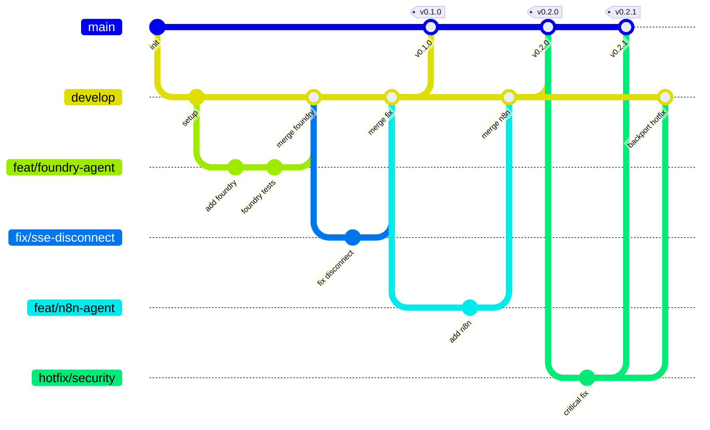

# unified-ui Agent Service

[](https://github.com/unified-ui/unifiedui-agent-service/actions/workflows/ci-tests-and-lint.yml)
[](https://go.dev/dl/)
[](LICENSE)
[](https://golangci-lint.run/)

> **The bridge to your AI backends** — A high-performance Go/Gin microservice that unifies heterogeneous AI agent systems behind a single API.

## What is unified-ui?

**unified-ui** transforms the complexity of managing multiple AI systems into a single, cohesive experience. Organizations deploy agents across diverse platforms—Microsoft Foundry, n8n, LangGraph, Copilot, and custom solutions—resulting in fragmented user experiences, inconsistent monitoring, and operational silos.

unified-ui eliminates these challenges by providing **one interface where every agent converges**.

## Role of the Agent Service

The **Agent Service** is the runtime layer that connects the unified-ui frontend to diverse AI backends. While the Platform Service handles authentication and configuration, the Agent Service focuses on:

| Responsibility | Description |
|----------------|-------------|
| 🔌 **Backend Abstraction** | Single API for N8N, Microsoft Foundry, Copilot, LangChain, and custom agents |
| ⚡ **Real-time Streaming** | SSE (Server-Sent Events) for live response delivery |
| 💬 **Message Management** | Store and retrieve conversation messages |
| 📊 **Trace Collection** | Aggregate traces from autonomous agents for monitoring |
| 🔐 **Session Caching** | Encrypted credential caching for fast, secure access |

**Key Principle**: The Agent Service delegates all authentication and configuration to the Platform Service. It focuses purely on agent communication and message handling.

---

## Architecture

```
                      ┌──────────────────────┐
                      │  UnifiedUI           │
                      │  Platform Service    │
                      │  (Auth + Config)     │
                      └──────────────────────┘
                                 ▲
                                 │
                                 ▼
┌───────────────┐     ┌──────────────────────┐     ┌──────────────────────────────────────┐
│  Frontend     │────▶│  UnifiedUI           │────▶│  Heterogene Backends                 │
│  (UnifiedUI)  │◀SSE─│  Agent Service       │◀────│  N8N, Foundry, Custom REST APIs, ... │
└───────────────┘     └──────────────────────┘     └──────────────────────────────────────┘
                                 ▲
                                 │
                       ┌─────────┼─────────┐
                       ▼         ▼         ▼
                 ┌─────────┐ ┌───────┐ ┌────────┐
                 │Document │ │ Cache │ │ Vault  │
                 │DB       │ │       │ │        │
                 └─────────┘ └───────┘ └────────┘
```

---

## Tech Stack

| Category | Technology |
|----------|------------|
| **Language** | Go 1.24+ |
| **Framework** | Gin |
| **Streaming** | SSE (Server-Sent Events) |
| **Document DB** | MongoDB / CosmosDB |
| **Cache** | Redis |
| **Vault** | Azure KeyVault / HashiCorp Vault |

---

## Getting Started

### Prerequisites

- Go 1.24+
- Redis
- MongoDB (or CosmosDB)
- Air (optional, for hot reload)

### Installation

```bash
# Clone the repository
git clone https://github.com/enricogoerlitz/unified-ui-agent-service.git
cd unified-ui-agent-service

# Copy environment variables
cp .env.example .env

# Install dependencies
make deps

# Run the service
make run
```

The API is available at `http://localhost:8085`

### Available Commands

| Command | Description |
|---------|-------------|
| `make run` | Start the server |
| `make dev` | Start with hot reload (Air) |
| `make test` | Run all tests |
| `make test-cover` | Run tests with coverage |
| `make lint` | Run golangci-lint |

> **See [TOOLING.md](TOOLING.md)** for detailed tooling documentation, pre-commit hooks, and code quality guidelines.

---

## API Endpoints

### Health Checks

| Endpoint | Description |
|----------|-------------|
| `GET /health` | Overall health status |
| `GET /health/ready` | Readiness probe |
| `GET /health/live` | Liveness probe |

### Messages

| Method | Endpoint | Description |
|--------|----------|-------------|
| `GET` | `/api/v1/agent-service/tenants/{tenantId}/conversation/{conversationId}/messages` | List messages |
| `POST` | `/api/v1/agent-service/tenants/{tenantId}/conversation/{conversationId}/messages` | Send message (SSE stream) |

### Traces

| Method | Endpoint | Description |
|--------|----------|-------------|
| `GET` | `/api/v1/agent-service/tenants/{tenantId}/messages/{messageId}/traces` | Get message traces |
| `PUT` | `/api/v1/agent-service/tenants/{tenantId}/autonomous-agents/{agentId}/traces` | Submit agent traces |

---

## Project Structure

```
├── cmd/server/            # Application entry point
├── internal/
│   ├── api/               # HTTP handlers, middleware, routes
│   ├── config/            # Configuration management
│   ├── core/              # Interfaces (cache, vault, docdb)
│   ├── domain/            # Domain models and errors
│   ├── infrastructure/    # Interface implementations
│   └── services/          # Business logic (agents, chat, platform)
├── tests/
│   ├── unit/              # Unit tests
│   ├── mocks/             # Mock implementations
│   └── testutils/         # Test utilities
└── docs/                  # Swagger documentation
```

---

## Adding New Agent Backends

1. Create client in `internal/services/agents/{name}/client.go`
2. Implement the `AgentClient` interface
3. Register in `internal/services/agents/factory.go`
4. Add tests in `tests/unit/services/agents/`

---

## Related Services

| Service | Description |
|---------|-------------|
| [unified-ui-frontend](https://github.com/enricogoerlitz/unified-ui-frontend-service) | React frontend |
| [unified-ui-platform-service](https://github.com/enricogoerlitz/unified-ui-platform-service) | Platform Service (Auth, RBAC, Core DB) |
| [unifiedui-sdk](https://github.com/enricogoerlitz/unifiedui-sdk) | Python SDK for external integrations |

---

## Branching Strategy

This project follows a **Simplified Flow** branching model — optimized for service releases with clear separation between integration and production.



### Branch Types

| Branch | Purpose | Branches from | Merges into |
|--------|---------|---------------|-------------|
| `main` | Production releases — stable, deployable code | — | — |
| `develop` | Integration branch for features and fixes | `main` | `main` |
| `feat/<name>` | New features or enhancements | `develop` | `develop` |
| `fix/<name>` | Bug fixes (non-critical) | `develop` | `develop` |
| `hotfix/<name>` | Critical production fixes | `main` | `main` + `develop` |
| `docs/<name>` | Documentation-only changes | `develop` | `develop` |
| `refactor/<name>` | Code restructuring without behavior changes | `develop` | `develop` |

### Workflow

1. **Feature/Fix development** — Create a `feat/` or `fix/` branch from `develop`. Open a PR back into `develop`.
2. **Release** — When ready, open a PR from `develop` to `main`. On merge, tag with version.
3. **Hotfixes** — For critical bugs, create a `hotfix/` branch from `main`, fix, and PR to `main`. Then backport to `develop`.

### Rules

- **Never commit directly** to `main` or `develop` — always use PRs
- **All PRs require** passing CI (tests, lint, vet, coverage)
- **Branch naming**: `<type>/<short-description>` (e.g. `feat/foundry-agent`, `fix/sse-disconnect`)

---

## Contributing

Contributions are welcome! Please read [CONTRIBUTING.md](CONTRIBUTING.md) for details on our development workflow, code standards, and how to submit pull requests.

---

## Sponsors

If you find this project useful, consider [sponsoring](SPONSORS.md) its development.

---

## License

MIT License — see [LICENSE](LICENSE) for details.
